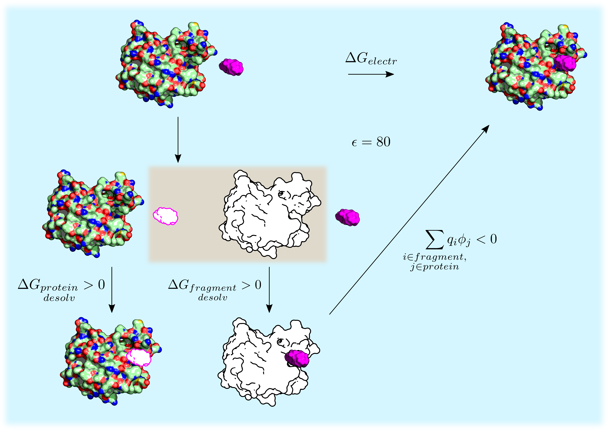

Energy models
=============

The binding energy is evaluated in SEED as the sum of the Van der Waals 
interaction and the electrostatic energy.
The main assumption underlying the evaluation of the electrostatic 
energy in solution of a fragment-receptor complex is the description 
of the solvent effects by continuum electrostatics.
The system is partitioned into solvent and solute regions and 
different dielectric constants are assigned to each region 
(dielectric constant of the solute, i.e. receptor and fragment, in **p1** 
(usually between 1.0 and 4.0) and dielectric constant of the solvent, 
normally 80 for water, as the 3rd term of **p21**).
In this approximation only the intra-solute electrostatic interactions 
need to be evaluated explicitly, strongly reducing the number of 
energy evaluations with respect to an explicit treatment of the solvent.

The procedure to calculate the difference in electrostatic energy 
:math:`\Delta G_{electr}` upon binding of a fragment to a receptor is depicted 
in figure. The binding process 
(first row of the thermodynamic cycle) is decomposed into a cycle
by introducing an uncharged copy of the solute (white-filled receptor and fragment).
The binding free energy can then be decomposed into three terms:

* Partial desolvation of the receptor: electrostatic energy difference 
  upon binding an uncharged fragment to a charged receptor
  in solution.
* Partial desolvation of the fragment: electrostatic energy difference 
  upon binding a charged fragment to an uncharged receptor in 
  solution. This term makes use of the GB treatment in the accurate energy model.
* Screened fragment-receptor interaction: intermolecular 
  electrostatic energy in solution. This is represented as the swapping of 
  the charged and uncharged fragment in the bottom of the thermodynamic cycle. 
  The term is written as the pairwise sum 
  :math:`\sum_{\substack{i \in fragment, \\ j \in protein}} q_i \phi_j`
  where the values of :math:`\phi_j` 
  (i.e., the electrostatic potential of the protein atom :math:`j`) 
  are calculated by the GB model in the accurate energy description.

Note that the addition of the uncharged solute (highlighted 
by the brown box) does not modify the electrostatic energy as this solute 
does not interact with water.

The single terms can be evaluated in SEED according to two different energy models: 
the accurate model (section :ref:`accu_model`) and the fast model 
(section :ref:`fast_model`). 
The two models are combined together in a two-step docking procedure.

    
    Decomposition of the electrostatic energy difference upon receptor-fragment binding 
    :math:`\Delta G_{electr}`. 
    Charged solute is colored and uncharged solute is white. 
    The fragment is in purple. The whole cycle takes place in water (blue background). 
    The brown background box highlights the introduction of an uncharged copy of the solute.

.. _fast_model:

Fast Energy
-----------
WORK IN PROGRESS

Please for the moment refer to the pdf user manual ``seed_4.0.0_doc.pdf``

.. _accu_model:

Slow Energy
-----------
WORK IN PROGRESS

Please for the moment refer to the pdf user manual ``seed_4.0.0_doc.pdf``
