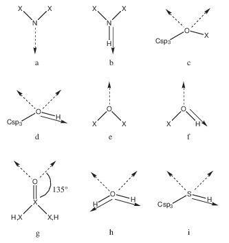
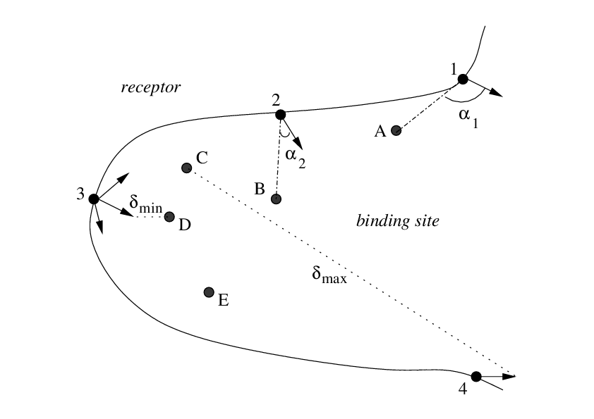

.. _vectors:

Vectors for docking 
===================

The binding site where the fragments are to be docked is defined by a list of receptor 
residues (possibly including explicit water molecules, treated as part of the receptor 
molecule).
The first line of :ref:`i3<i3>` is the number of residues in the binding site 
and the following lines are the residue sequential numbers 
(*e.g.* if ARG38 is the first residue of the protein, its sequential 
number is 1 and not 38). If a metal ion belongs to the binding site, 
its sequential number also has to be in the list.

Vectors for polar docking 
------------------------- 

Fragments are considered polar if they have at least one H-bond donor or acceptor. 
SEED docks polar fragments where at least one hydrogen bond with good geometry is made. 

First, predefined rules (see figure) allow the distribution of vectors of 
unitary length on all H-bond groups of the fragment in a direction 
for an ideal H-bond geometry. For example, if a nitrogen atom is bound to 
two heavy atoms, one H-bond vector is generated in the direction of either 
the lone pair (Figure 1a) or the NH bond (Figure 1b). The same procedure is 
then used for the polar groups in the receptor binding site (backbone and side chains). 
These rules are based on the atomic element number. A correspondence between atom types and atomic element 
numbers has to be specified in :ref:`p29<p29>`: the first line is the total number 
of correspondences and the first three terms of the following lines are 
respectively a sequential index number, the atom type and the atomic 
element number. Vectors for metal ions have to be provided by the user. 
The first line of :ref:`i5<i5>` is the total number of vectors for the 
metal ions and each of the following lines contains the atom number of the metal as 
it is in the receptor mol2 file and the coordinates of the vector extremity. 
The vector is then built by joining the vector extremity to the metal ion center. 

   
   Description of polar vectors for the fragment and for the receptor. X is a 
   heavy atom. The broken arrow represents a vector of H-bond acceptor in the 
   lone pair direction and the full arrow a vector of H-bond donor. 
   The geometry of c, d, h and i is tetrahedral (angle of :math:`109^\circ`). 
   Examples: (a) imidazole, pyridine, (b) protein backbone, imidazole, indole, 
   (c) ethers, (d) Ser and Thr side chains, sugars, (e) methoxybenzene, (f) Tyr side 
   chain, phenol, (g) Asn, Gln, Asp, and Glu side chains, protein backbone, 
   acetamide, (h) water, (i) Cys side chain.

For the receptor polar groups and metal ions an additional set of vectors is 
distributed uniformly on a spherical region around each of the ideal directions 
to increase the spatial sampling. The first term of :ref:`p12<p12>` is 
the maximal angular deviation from ideal hydrogen bond geometry and the second term is 
the number of additional vectors to distribute uniformly on the spherical region.

To discard receptor vectors that point into a region of space occupied 
by other atoms of the protein and select preferentially vectors in the 
concave regions of the receptor, a spherical probe is set on 
the vector extremity at a distance corresponding to the sum of the 
van der Waals radii of the acceptor or donor atom and the probe. 
The van der Waals radius of the probe in Å is specified 
in :ref:`p15<p15>` and those of the atom types are specified in the 
4th column of :ref:`p29<p29>`. The van der Waals interaction (see below) 
between the probe and all the receptor atoms 
is then evaluated except for the receptor hydrogen atom involved in the H-bond. 
The vectors which show less favorable van der Waals energies are discarded. 
The number of selected polar vectors is modified through the first term of :ref:`p2<p2>`. 

Finally, the docking itself is achieved by matching an H-bond vector 
of the receptor with an H-bond vector of the fragment at a distance 
that depends on the atom types of donor and acceptor involved in the hydrogen bond. 
These bond lengths are specified in :ref:`p30<p30>` 
(a default length on the first line and two blocks where lengths are set 
between element types and atom types respectively; 
each block starts with the number of following lines in the block). 
The fragment is then rotated around the H-bond axis to increase sampling. 
The number of rotations is set in :ref:`p13<p13>`.

Vectors for apolar docking 
--------------------------

SEED docks apolar fragments into hydrophobic regions of the receptor. 
First, a number of points are distributed uniformly on the solvent-accessible 
surface (SAS) of the fragment. The density of 
surface points for the fragment is set in the second term 
of :ref:`p22<p22>`. Second, an automatic procedure defines the hydrophobic 
regions on the receptor. 
For this purpose a number of points are uniformly distributed on the SAS 
of the binding site (density of surface points for the receptor 
in the first term of :ref:`p22<p22>`). 
A low dielectric sphere is placed on each of these points, 
and the receptor desolvation energy and the probe/receptor van der Waals 
interaction are evaluated. The radius of the sphere is the 
third term of :ref:`p22<p22>`: a value of 1.4 Å allows a 
finer description of the narrow pockets than with a value of 1.8 Å. 
The points on the receptor SAS are then ranked according to the sum of 
the two energy terms weighted by scaling factors that are set by the last two terms
of :ref:`p22<p22>`. 
The number of selected apolar points can be modified with 
the second term of :ref:`p2<p2>`.  
For both the fragment and the receptor, vectors are defined by joining 
each point on the SAS with the corresponding atom center. Finally, 
apolar fragments are docked by matching a vector of the fragment with 
a vector of the receptor at the optimal van der Waals distance. 
To improve sampling additional rotations of the fragment are performed 
around the axis joining the receptor atom and fragment atom. 
The number of rotations is set in :ref:`p13<p13>`.

.. _angle_criterion:

Angle criterion
---------------

To discard polar and apolar receptor vectors that point outside of the binding site 
a selection using an angle criterion (see figure) can be activated 
(:ref:`i4<i4>` and :ref:`p14<p14>`).

   
   1-4: receptor atoms and vectors. A-E: user-defined anchor points in the 
   binding site (*e.g.*, fragment heavy atoms). The angle between a 
   vector and its closest anchor point in the binding site is shown for 
   two vectors (:math:`\alpha_1`, :math:`\alpha_2`). Reasonable 
   parameters should allow to remove the vector of atom 1 from the list of receptor 
   vectors and keep the vector of atom 2. 
   :math:`\delta_{min}` and :math:`\delta_{max}` are defined in the text.
   
It is applied directly after vectors have been distributed on the binding site, 
*i.e.*, before the selection by means of a spherical probe for polar vectors 
and before the selection by means of a low dielectric sphere for apolar vectors. 
The first line of :ref:`i4<i4>` is the number of user-defined anchor points 
in the binding site and the following lines are their coordinates. 
The anchor points can be for example the fragment heavy 
atoms obtained from a known fragment-receptor complex structure. 
The minimal and maximal distances (:math:`\delta_{min}` and :math:`\delta_{max}`) 
between the extremity of the vectors and the anchor points 
in the binding site are first evaluated. A vector is then discarded 
if the angle between the vector and the closest anchor point in the binding site 
(angle anchor_point--vector_origin--vector_extremity) is larger than an angle cutoff. 
The angle cutoff is :ref:`p14<p14>`\ :sub:`1` (first parameter in :ref:`p14<p14>`) 
if the distance between the vector and the closest anchor point is smaller 
or equal to :math:`\delta_{min} \times` :ref:`p14<p14>`\ :sub:`3`; 
the angle cutoff is :ref:`p14<p14>`\ :sub:`2` if the distance is larger or equal to 
:math:`\delta_{max} \times` :ref:`p14<p14>`\ :sub:`4`. 
For other distances the angle cutoff value falls between :ref:`p14<p14>`\ :sub:`1` 
and :ref:`p14<p14>`\ :sub:`2` (linear dependence). 
Reasonable parameters provide permissive angle cutoffs for vectors close to an 
anchor point and stricter angle cutoffs for distant vectors. 

Polar and apolar docking
------------------------

Some "polar" fragments can have considerable hydrophobic character (*e.g.*, diphenyl-
ether). Therefore, they can also be docked by the procedure for apolar fragments. 
The second column of :ref:`i7<i7>` allows 
the user to select apolar docking (``a``), polar docking (``p``) or both (``b``). 
   
